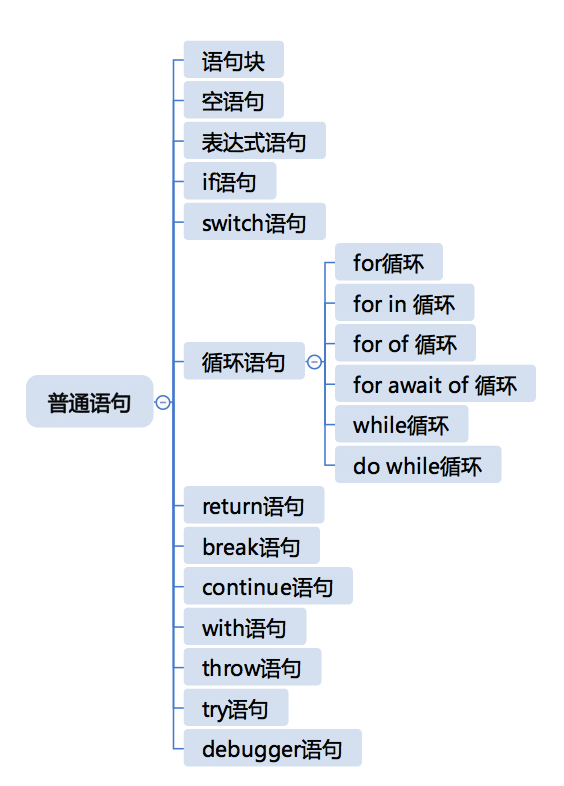
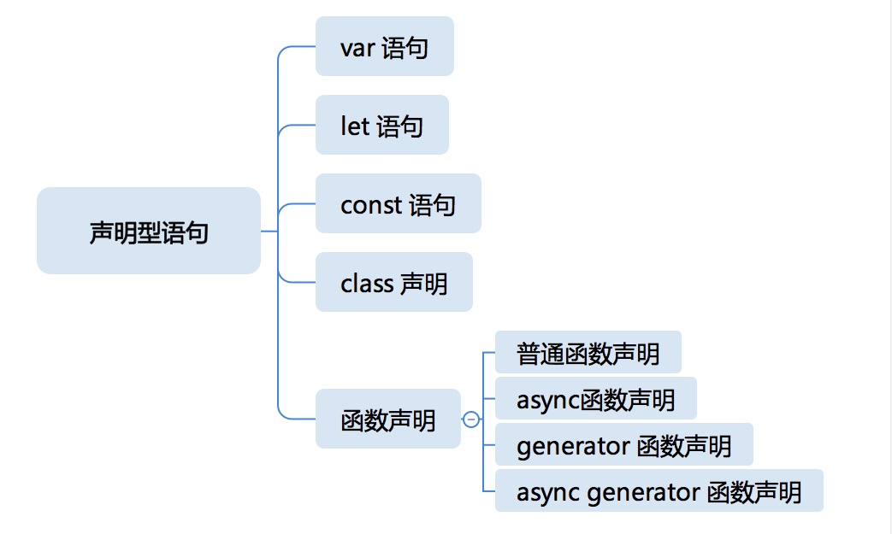

# 运算符、表达式和类型转换

## 运算符

在一些通用的计算机语言设计理论中，能够出现在赋值表达式右边的叫做：右值表达式（RightHandSideExpression），而在 JavaScript 标准中，规定了在等号右边表达式叫做条件表达式（ConditionalExpression），不过，在 JavaScript 标准中，从未出现过右值表达式字样。JavaScript 标准也规定了左值表达式同时都是条件表达式（也就是右值表达式），此外，左值表达式也可以通过跟一定的运算符组合，逐级构成更复杂的结构，直到成为右值表达式。

优先级顺序如下

- 更新表达式 UpdateExpression
- 一元运算表达式 UnaryExpression
- 乘方表达式 ExponentiationExpression
- 乘法表达式 MultiplicativeExpression
- 加法表达式 AdditiveExpression
- 移位表达式 ShiftExpression
- 关系表达式 RelationalExpression
- 相等表达式 EqualityExpression
- 位运算表达式
- 逻辑与表达式和逻辑或表达式
- 条件表达式 ConditionalExpression

## 表达式

表达式语句实际上就是一个表达式，它是由运算符连接变量或者直接量构成的。一般来说，我们的表达式语句要么是函数调用，要么是赋值，要么是自增、自减，否则表达式计算的结果没有任何意义。但是从语法上，并没有这样的限制，任何合法的表达式都可以当做表达式语句使用

### PrimaryExpression 主要表达式

Primary Expression 包含了各种“直接量”，直接量就是直接用某种语法写出来的具有特定类型的值。我们已经知道，在运行时有各种值，比如数字 123，字符串 Hello world，所以通俗地讲，直接量就是在代码中把它们写出来的语法。

### MemberExpression 成员表达式

Member Expression 通常是用于访问对象成员的。它有几种形式：

```javascript
a.b;
a["b"];
new.target;
super.b;
```

前面两种用法都很好理解，就是用标识符的属性访问和用字符串的属性访问。而 new.target 是个新加入的语法，用于判断函数是否是被 new 调用，super 则是构造函数中，用于访问父类的属性的语法。从名字就可以看出，Member Expression 最初设计是为了属性访问的，不过从语法结构需要，以下两种在 JavaScript 标准中当做 Member Expression：

```javascript
f`a${b}c`;
```

这是一个是带函数的模板，这个带函数名的模板表示把模板的各个部分算好后传递给一个函数。

### NewExpression NEW 表达式

Member Expression 加上 new 就是 New Expression

### CallExpression 函数调用表达式

除了 New Expression，Member Expression 还能构成 Call Expression。它的基本形式是 Member Expression 后加一个括号里的参数列表，或者我们可以用上 super 关键字代替 Member Expression。

```javascript
a.b(c);
super();
```

### LeftHandSideExpression 左值表达式

New Expression 和 Call Expression 统称 LeftHandSideExpression，左值表达式。我们直观地讲，左值表达式就是可以放到等号左边的表达式。

### AssignmentExpression 赋值表达式

AssignmentExpression 赋值表达式也有多种形态，最基本的当然是使用等号赋值

```javascript
a = b;
a = b = c = d;
```

### Expression 表达式

值表达式可以构成 Expression 表达式的一部分。在 JavaScript 中，表达式就是用逗号运算符连接的赋值表达式。

在 JavaScript 中，比赋值运算优先级更低的就是逗号运算符了。我们可以把逗号可以理解为一种小型的分号。

# 语句和声明





# 宏任务和微任务

JavaScript 引擎等待宿主环境分配宏观任务，在操作系统中，通常等待的行为都是一个事件循环，所以在 Node 术语中，也会把这个部分称为事件循环。整个循环做的事情基本上就是反复“等待 - 获取代码 - 执行”。每个宏观任务中又包含了一个微观任务队列。

# JS 函数调用

- lexical environment：词法环境，当获取变量或者 this 值时使用。
- variable environment：变量环境，当声明变量时使用。
- code evaluation state：用于恢复代码执行位置。
- Function：执行的任务是函数时使用，表示正在被执行的函数。
- ScriptOrModule：执行的任务是脚本或者模块时使用，表示正在被执行的代码。
- Realm：使用的基础库和内置对象实例。
- Generator：仅生成器上下文有这个属性，表示当前生成器。

## Realm

在最新的标准（9.0）中，JavaScript 引入了一个新概念 Realm，它的中文意思是“国度”“领域”“范围”。

在 ES2016 之前的版本中，标准中甚少提及{}的原型问题。但在实际的前端开发中，通过 iframe 等方式创建多 window 环境并非罕见的操作，所以，这才促成了新概念 Realm 的引入。

Realm 中包含一组完整的内置对象，而且是复制关系。对不同 Realm 中的对象操作，会有一些需要格外注意的问题，比如 instanceOf 几乎是失效的。

以下代码展示了在浏览器环境中获取来自两个 Realm 的对象，它们跟本土的 Object 做 instanceOf 时会产生差异：

```javascript
var iframe = document.createElement("iframe");
document.documentElement.appendChild(iframe);
iframe.src = "javascript:var b = {};";
var b1 = iframe.contentWindow.b;
var b2 = {};
console.log(typeof b1, typeof b2); //object object
console.log(b1 instanceof Object, b2 instanceof Object); //false true
```

可以看到，由于 b1、 b2 由同样的代码“ {} ”在不同的 Realm 中执行，所以表现出了不同的行为。
